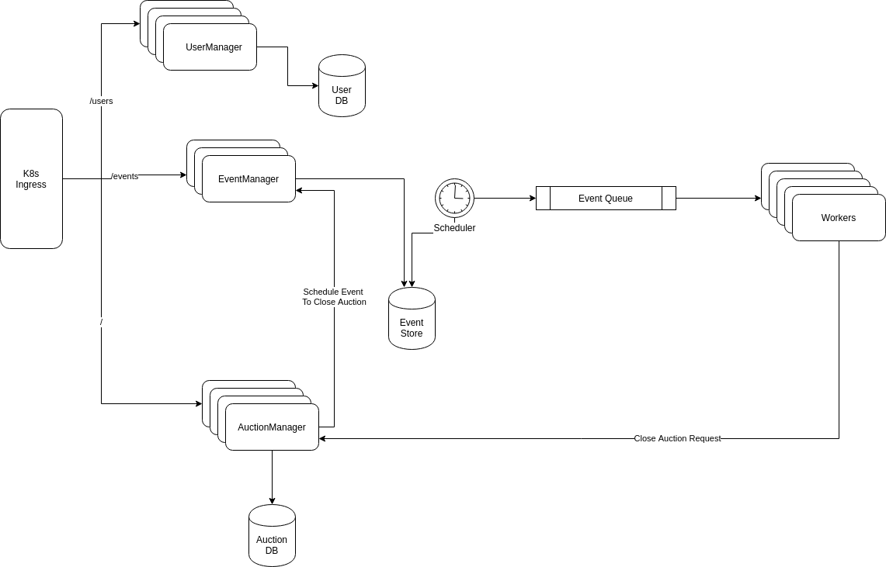

# Design For Auction Bidding

## High Level Design



### Components
#### UserManager
Usermanager manages crud operations for user data, It stores data in a relational DB, postgres is used here. There are two type of users admin and non-admin. Only admins are allowed to create and view other users data. Non-admin can see only his own data.

#### Auction Manager

Auction manager manages cruds for auctions and bids, it uses posgres to store data.

**Auction**:
An auction can be created with  its name, a description,  starting price, start and end times.
```json
{
    "name" : "Test Auction",
    "description" : "test description",
    "start_price" : 100,
    "start_at": "2020-04-08T06:31:23.402Z",
    "end_at" : "2020-04-12T06:38:23.402Z"
}
```
Olny admin can create auctions, all users can view all auctions

**Bid**: A bid can be created with a price which is higher than auction's start_price. All users can make bids. Admin can view all bids and non-admins can view their own bids.

#### Event Manager

Eventmanager is an  interface for scheduling generic events. An event can be created with `time`, `data` and `type` of event. 
```json
 {
    "time": "2020-04-10T06:38:23.402Z",
    "data": "23",
    "type": "close-auction"
}
```

Event manager stores event data in its own data store. If time difference between current time and scheduled time is less than a threshold then event scheduler directly push that event to event queue, otherwise the scheduler componet will do it.

Auction manager hits event manager to schedule `close_auction` event while an auction is created and an event will be scheduled with time as end time of the auction.


#### Scheduler

A job scheduler is running in every 2 minutes as a k8s cron job. It will get all events scheduled for next 2 minutes from the event store and enqueue to event queue.


Here this scheduler can be used to process upto 5 lack events per minute. If it needs to be scaled further, event store can be sharded into multiple shards and a scheduler can run for every shard.


#### Worker
Workers will be getting events from queue executing the events. Here it will be hitting auction manager to close auction. Workers can be horizontally scaled based on the queue length.

## Technologies Used
1. Message Queue: Beanstalkd
2. DB: PostgresSQL
3. Docker
4. Kubernetes